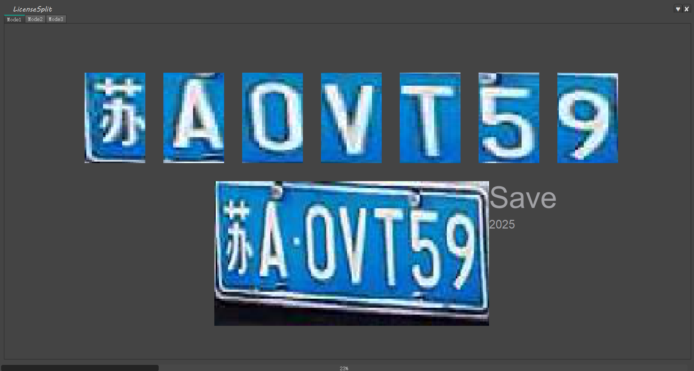

# 快速车牌字符标注工具

为了对完整车牌的各个字符进行标注，我们又开发了一款高效的车牌分割标注软件“LicenseSplit”，该软件利用440mm*140mm的中国机动车牌号牌**各个字符之间固定的位置关系**，当你标注好两端的字符的时候，中间的字符即可**自动完成框选**，标注结束后数据直接可以用来训练，从而又大大提高了车牌字符训练集的建立以达到更好的识别效果。

1. 快速框选车牌中的各个字符并记录位置。
2. 高效标注各个车牌字符的具体内容。
3. 多线程对所标注数据进行整合。

